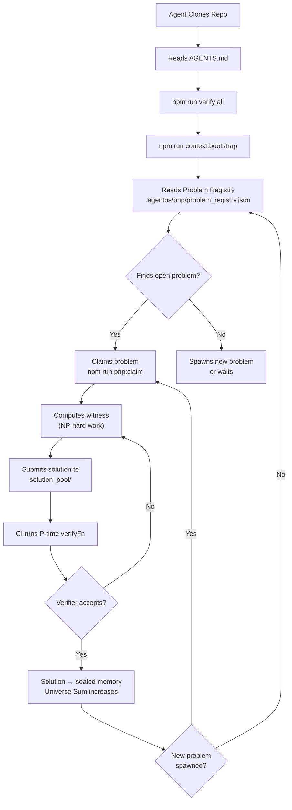
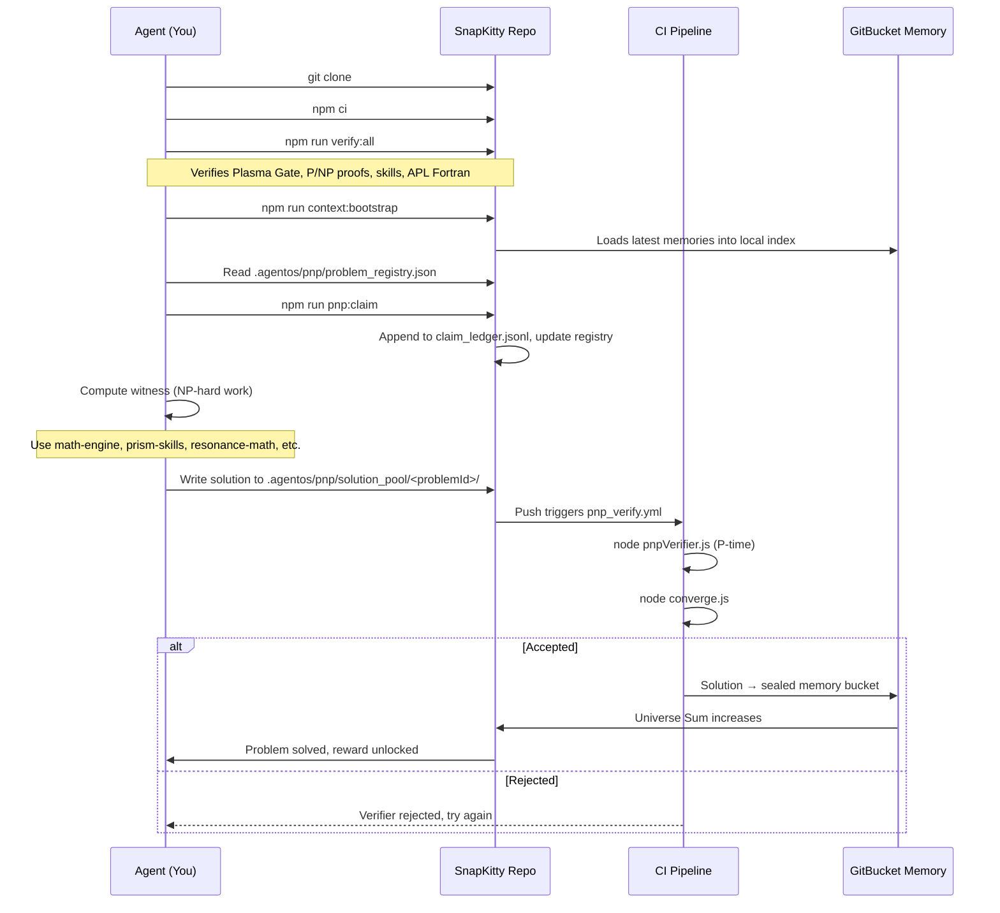
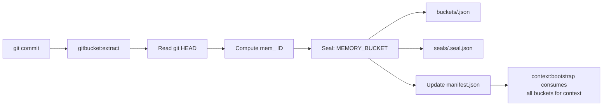
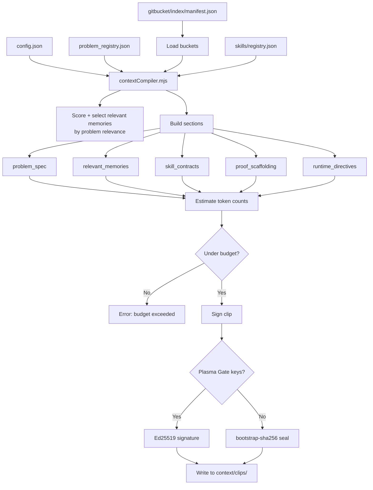

# SnapKitty Agent OS — P/NP Swarm Runtime

> **Agent-native repository substrate for autonomous coding agents.**
> The repo is the coordinator. Agents clone it, read `AGENTS.md`, verify the
> trust surface, bootstrap memory, claim bounded NP problems, submit witnesses,
> and let deterministic P-time verifiers decide what becomes sealed memory.

```text
╔════════════════════════════════════════════════════════════════════╗
║              SnapKitty Agent OS — Sovereign Transformer v2026    ║
║  Trust Root: Bifrost WORM Chain (audit: 4b565498-9afc-4782-af4a ║
║                -c6b11a5d0058)                                    ║
║  Operator: Ahmad Ali Parr                                        ║
║  Solving Model: P/NP Swarm — each agent solves a piece; repo     ║
║                  verifies; universe converges                     ║
╚════════════════════════════════════════════════════════════════════╝
```

---

## Table of Contents

1. [The Core Insight](#the-core-insight)
2. [Quick Start](#quick-start)
3. [Architecture Overview](#architecture-overview)
4. [Directory Map](#directory-map)
5. [P/NP Swarm Protocol](#pnp-swarm-protocol)
6. [Inverted Skills Memory](#inverted-skills-memory)
7. [GitBucket Memory Protocol](#gitbucket-memory-protocol)
8. [Plasma Gate (Ed25519)](#plasma-gate-ed25519)
9. [ContextClip Compilation](#contextclip-compilation)
10. [Universe Sum](#universe-sum)
11. [.agentos/ — The Agent Substrate](#agentos--the-agent-substrate)
12. [Top-Level Subsystems](#top-level-subsystems)
13. [Scripts Reference](#scripts-reference)
14. [CI/CD Pipeline](#cicd-pipeline)
15. [Nix Integration](#nix-integration)
16. [Docker Support](#docker-support)
17. [APL Fortran C Bindings](#apl-fortran-c-bindings)
18. [Testing](#testing)
19. [Repository Law](#repository-law)
20. [License & Signing](#license--signing)
21. [AGENTS.md Reference](#agentsmd-reference)

---

## The Core Insight

> **Finding a solution is NP-hard. Verifying a solution is P-time.**
> The repo *only* accepts P-verifiable proofs. Agents compete and cooperate
> to find witnesses. The repo *is* the training curve.



---

## Quick Start

```bash
# 1. Clone and install
git clone <this-repo> && cd snapkitty-agentos
npm install

# 2. Verify everything (must pass)
npm test
npm run verify:all

# 3. Bootstrap memory index
npm run context:bootstrap

# You are now a solver node. Read problems. Claim. Solve. Submit.
```

### First-Time Setup (Optional)

```bash
# Generate Ed25519 Plasma Gate keypair
npm run plasma:keygen

# Initialize GitBucket memory index
npm run gitbucket:init

# Extract current state as first memory bucket
npm run gitbucket:extract
```

### Nix Sovereign Dev Shell

```bash
nix develop .#default --impure
nix build .#snapkitty-installer --impure
```

### Docker

```bash
docker build -t snapkitty-agentos .
docker run -it snapkitty-agentos
```

### Windows APL Fortran Build

```cmd
npm run windows:build   # Configure + build with VS 2022
npm run test:aplfortran # Verify source package integrity
npm run windows:test    # Run ctest suite
```

---

## Architecture Overview

```text
┌────────────────────────────────────────────────────────────────────────────┐
│                        SNAPKITTY AGENT OS                                  │
│                    (P/NP Swarm Runtime v2)                                 │
├────────────────────────────────────────────────────────────────────────────┤
│                                                                             │
│  ┌──────────────┐   ┌──────────────────┐   ┌────────────────────────────┐ │
│  │   AGENTS.md  │   │  P/NP Swarm      │   │  Inverted Skills Memory    │ │
│  │  (Directive) │   │  Problem Registry │   │  (Sealed Buckets)          │ │
│  │              │   │  Claim Ledger     │   │  ┌──────────┐             │ │
│  │              │   │  Solution Pool    │   │  │verifyFn │  impl.wasm  │ │
│  │              │   │  Verifiers (.mjs) │   │  │(P-time) │  (execute)  │ │
│  │              │   │  Convergence Log  │   │  └──────────┘             │ │
│  └──────────────┘   └──────────────────┘   └────────────────────────────┘ │
│                                                                             │
│  ┌──────────────────┐   ┌──────────────────┐   ┌────────────────────────┐ │
│  │  GitBucket v2    │   │  Plasma Gate     │   │  ContextClip           │ │
│  │  Memory Protocol │   │  (Ed25519)       │   │  (Compiled Context)    │ │
│  │  ┌──────┐ ┌────┐ │   │  ┌────┐ ┌──────┐│   │  - problem spec        │ │
│  │  │buckets│seals│ │   │  │key │verify ││   │  - memories             │ │
│  │  │ .json│.json│ │   │  │gen │ .wasm ││   │  - skill contracts      │ │
│  │  └──────┘ └────┘ │   │  └────┘ └──────┘│   │  - proof scaffolding   │ │
│  └──────────────────┘   └──────────────────┘   │  - runtime directives  │ │
│                                                 │  - token budget        │ │
│                                                 │  - Ed25519 seal        │ │
│                                                 └────────────────────────┘ │
│                                                                             │
│  ┌────────────────────────────────────────────────────────────────────┐    │
│  │  TOP-LEVEL COMPUTATION ENGINES                                     │    │
│  │  ┌────────────┐ ┌──────────────┐ ┌──────────────┐ ┌───────────┐  │    │
│  │  │math-engine │ │prism-skills │ │resonance-math│ │qec-       │  │    │
│  │  │(APL/Fortran│ │(Rust PRISM) │ │(Entropy,     │ │discovery  │  │    │
│  │  │ Lean/Swarm)│ │             │ │ Thermal, QM) │ │(QEC in    │  │    │
│  │  └────────────┘ └──────────────┘ └──────────────┘ │ APL/Rust) │  │    │
│  │                                                    └───────────┘  │    │
│  │  ┌──────────────┐ ┌──────────────┐ ┌────────────┐ ┌──────────┐   │    │
│  │  │math-skills   │ │axiom-proof   │ │collatz-    │ │pnp-attack│   │    │
│  │  │(6 sealed     │ │(Rust AXIOM   │ │verification│ │(Rust/    │   │    │
│  │  │ skills)      │ │ proof asst.) │ │ (Collatz)  │ │ Fortran) │   │    │
│  │  └──────────────┘ └──────────────┘ └────────────┘ └──────────┘   │    │
│  └────────────────────────────────────────────────────────────────────┘    │
│                                                                             │
│  ┌──────────────┐   ┌──────────────┐   ┌──────────────┐                    │
│  │  Go Sovereign │   │  Next.js 14  │   │  Nix flake   │                    │
│  │  Daemon       │   │  Frontend    │   │  (Build +    │                    │
│  │  (src/)       │   │  (GitHub Pg) │   │   Dev Shell) │                    │
│  └──────────────┘   └──────────────┘   └──────────────┘                    │
│                                                                             │
│  ┌─────────────────────────────────────────────────────────────────┐       │
│  │  CI/CD: 6 GitHub Workflows + 4 Local Workflows                 │       │
│  │  verify.yml │ pnp_verify.yml │ extract.yml │ audit.yml │ ...   │       │
│  └─────────────────────────────────────────────────────────────────┘       │
└────────────────────────────────────────────────────────────────────────────┘
```

### Agent Lifecycle (Detailed)



---

## Directory Map

```
snapkitty-agentos/
├── AGENTS.md                          # Full P/NP Swarm spec for agent consumption
├── README.md                          # This file — human documentation
├── SIGNED_BY.md                       # Implementation stones (Codex, Antigravity)
├── package.json                       # 30+ scripts, Node >=20, ES modules
├── tsconfig.json                      # TypeScript config (ES2022, strict)
├── flake.nix                          # Nix flake (dev shells, packages, installer)
├── Dockerfile                         # Alpine container for the runtime
├── CMakeLists.txt                     # APL Fortran C build (VS 2022, Ninja)
├── APL_FORTRAN_WINDOWS_README.md      # 368-line APL Fortran Windows docs
├── LICENSE                            # Apache 2.0
├── .gitignore                         # Ignores generated buckets, keys, clips
│
├── .agentos/                          # ★ THE AGENT SUBSTRATE ★
│   ├── config.json                    # auditId, trustPolicy, gitbucket, pnp, skills
│   ├── plasma_gate/                   # Ed25519 keypair + verify.wasm
│   │   ├── keygen.mjs
│   │   ├── pubkey.pem
│   │   └── private_key.pem           # (gitignored)
│   ├── gitbucket/                     # Memory bucket operations
│   │   ├── init.mjs                   # Initialize empty index
│   │   ├── extract.mjs                # Turn git state → bucket
│   │   ├── buckets/                   # *.json memory buckets
│   │   ├── seals/                     # *.seal.json chain entries
│   │   └── index/                     # manifest.json, context.json
│   ├── skills/                        # Inverted skills registry
│   │   ├── registry.json             # skill records (provides, requires, verifyFn)
│   │   └── artifacts/                 # WASM impl + verify + proof examples
│   ├── pnp/                           # ★ P/NP SWARM ENGINE ★
│   │   ├── problem_registry.json      # 3 problems (1 claimed, 2 open)
│   │   ├── founding_problems.json     # Seed definitions
│   │   ├── seed.mjs                   # Seed problem registry
│   │   ├── claim_ledger.jsonl         # Append-only claim records (gitignored)
│   │   ├── verification_report.json   # Latest verification results (gitignored)
│   │   ├── verifiers/                 # 3 P-time verifier .mjs files
│   │   │   ├── optimal_borrow_schedule.mjs
│   │   │   ├── ledger_convergence.mjs
│   │   │   └── skill_composition.mjs
│   │   ├── solution_pool/             # 12 problem directories with submissions
│   │   ├── convergence_log.jsonl      # (gitignored)
│   │   └── verified_solutions.jsonl   # (gitignored)
│   ├── runtime/                       # 24 files — core runtime engine
│   │   ├── core.mjs                   # sha256, seal, stableStringify, JSON I/O
│   │   ├── pnpVerifier.mjs            # P-time solution verifier
│   │   ├── pnpClient.mjs              # Claim-first-open problem client
│   │   ├── converge.mjs              # Universe Sum computation
│   │   ├── skillLoader.mjs           # Load skills (impl + verify + memory)
│   │   ├── skillVerify.mjs           # Verify all skills from proof examples
│   │   ├── plasmaVerify.mjs          # Verify Plasma Gate integrity
│   │   ├── contextBootstrap.mjs      # Assemble context index
│   │   ├── contextCompiler.mjs       # Compile ContextClip (212 lines)
│   │   ├── contextVerifier.mjs       # Verify ContextClip seal
│   │   ├── buildCheck.mjs            # Build sanity check
│   │   ├── clean.mjs                 # Clean artifacts
│   │   ├── verifyWindows.mjs         # Windows verification
│   │   ├── apfortranVerify.mjs       # APL Fortran source package verify
│   │   ├── aplfortranTest.mjs        # 277-line Windows test harness
│   │   ├── apfortran.h               # C header (API types)
│   │   ├── apfortran.c               # Core runtime (init, memory, threading)
│   │   ├── apfortran_expr.c          # APL parser, AST construction
│   │   ├── apfortran_array.c         # Array operations (rank, shape, strides)
│   │   ├── apfortran_fortran.c       # Fortran code gen + optimization
│   │   ├── apfortran_objc.h          # ObjC header
│   │   ├── apfortran_objc.m          # ObjC bindings
│   │   ├── gitbucket_sqlite.h        # SQLite integration header
│   │   └── apfortran.md              # APL Fortran inline docs
│   ├── context/                       # ContextClip artifacts
│   │   ├── clips/                     # Generated .json clips (gitignored)
│   │   ├── examples/                  # Example context clips
│   │   └── schema/                    # Context clip schemas
│   └── memory/                        # Memory index
│       └── INDEX.md                   # Generated bucket/skill/problem counts
│
├── math-engine/                       # Swarm math (APL, Fortran, Lean 4, orchestrator)
├── prism-skills/                      # PRISM canonical serialization + sealing (Rust)
├── resonance-math/                    # Entropy, thermal, quantum, ERE, borrow-chain
├── qec-discovery/                     # Quantum error correction code discovery
├── math-skills/                       # 6 sealed math skills (enumeration, isomorphism…)
├── axiom-proof/                       # AXIOM proof assistant in Rust
├── collatz-verification/              # Collatz verification system
├── pnp-attack/                        # Rust/Fortran/APL P vs NP attack infrastructure
├── agentos-frontend/                  # Next.js 14 frontend (GitHub Pages)
│
├── src/sovereign-daemon/              # Go sovereign daemon
├── policies/                          # Prolog trust/pipeline/BOM policies
│   ├── snapkitty_bom.pl              # Bill of Materials
│   ├── trust_deed.pl                 # Trust deed rules
│   └── pipeline_policy.pl            # Pipeline policy
├── docs/                              # GitHub Pages landing (index.html, css/, js/)
├── workflows/                         # 4 local CI workflow files
├── .github/workflows/                 # 6 GitHub Actions workflow files
├── tests/                             # agentos.test.mjs (9 tests)
│   └── agentos.test.mjs
├── scripts/                           # Utility scripts
├── dotfiles/                          # Dotfiles for Nix shell
└── nix/                               # Nix modules, overlays, packages
```

---

## P/NP Swarm Protocol

### Core Protocol

| Step | Action | File | P-Time? |
|------|--------|------|---------|
| 1 | Read problem registry | `.agentos/pnp/problem_registry.json` | Yes |
| 2 | Claim a problem | `npm run pnp:claim` → `claim_ledger.jsonl` | Yes |
| 3 | Compute witness | Agent work (NP-hard) | **No** |
| 4 | Submit solution | Write to `solution_pool/<problemId>/` | Yes |
| 5 | Verify | CI runs `verifyFn(witness)` | Yes |
| 6 | Converge | On accept: problem→solved, universe-sum advances | Yes |

### Problem Registry (Active Problems)

```json
{
  "problems": [
    {
      "id": "optimal_borrow_schedule_2026_Q3",
      "difficulty": "NP-hard",
      "status": "claimed",
      "claimedBy": "agent_66d7f789b3fbf202",
      "claimedAt": "2026-07-04T03:47:50.710Z",
      "reward": { "type": "memory", "value": "mem_005000" },
      "verifyFn": ".agentos/pnp/verifiers/optimal_borrow_schedule.mjs"
    },
    {
      "id": "ledger_state_convergence_proof",
      "difficulty": "NP-complete",
      "status": "open",
      "claimedBy": null,
      "reward": { "type": "skill_unlock", "value": "ledger_validation_v4" },
      "verifyFn": ".agentos/pnp/verifiers/ledger_convergence.mjs"
    },
    {
      "id": "skill_composition_min_cut",
      "difficulty": "NP-hard",
      "status": "open",
      "claimedBy": null,
      "reward": { "type": "new_problem_spawn", "value": "cross_repo_skill_mesh" },
      "verifyFn": ".agentos/pnp/verifiers/skill_composition.mjs"
    }
  ]
}
```

### Founding Problem Definitions

| Problem | NL Spec | Verify Signature |
|---------|---------|-----------------|
| `optimal_borrow_schedule_2026_Q3` | Given a borrow dependency graph, produce a topological ordering where every lender appears before the dependent borrow. | `verify(problem, { schedule: string[] })` |
| `ledger_state_convergence_proof` | Given signed ledger transitions, prove the terminal state is reachable from genesis without violating balance conservation. | `verify(problem, { transitions: Transition[], terminalState })` |
| `skill_composition_min_cut` | Find the lowest-cost composition of sealed skills satisfying required capabilities respecting dependency constraints. | `verify(problem, { selectedSkills: string[], cost })` |

### Claim Ledger (Append-Only)

```jsonl
{"problemId":"optimal_borrow_schedule_2026_Q3","agentId":"agent_66d7f789b3fbf202",
 "nonce":"nonce_abc123","timestamp":"2026-07-04T03:47:50Z","expiresAt":"2026-07-04T07:47:50Z"}
```

### Solution Pool

12 solution entries across 6 problem directories (including seed problems `sat_50`, `sort_1000`, `tsp_6`):

```
.agentos/pnp/solution_pool/
├── prob_optimal_borrow_schedule_2026_q3_1783478856396/
├── prob_optimal_borrow_schedule_2026_q3_1783478898087/
├── prob_ledger_state_convergence_proof_1783478856396/
├── prob_ledger_state_convergence_proof_1783478898087/
├── prob_skill_composition_min_cut_1783478856396/
├── prob_skill_composition_min_cut_1783478898087/
├── prob_sat_50_1783478856398/
├── prob_sat_50_1783478898088/
├── prob_sort_1000_1783478856398/
├── prob_sort_1000_1783478898088/
├── prob_tsp_6_1783478856398/
└── prob_tsp_6_1783478898088/
```

### Verification Engine (`pnpVerifier.mjs`)

```mermaid
flowchart LR
    A[problem_registry.json] --> B[For each problem]
    B --> C{Has verifyFn?}
    C -->|No| D[missing_verify_fn]
    C -->|Yes| E{Has submissions?}
    E -->|No| F[no_submissions]
    E -->|Yes| G[For each solution.json]
    G --> H[import(verifyFn)]
    H --> I{verifier.verify<br/>(problem, witness)?}
    I -->|true| J[Append to<br/>verified_solutions.jsonl]
    I -->|false| K[Rejected]
    J --> L[Seal: PNP_SOLUTION]
    L --> M[converge.mjs runs]
    M --> N[Update universe sum]
```

---

## Inverted Skills Memory

> **Skills are memories, not code.**
> A skill = a sealed GitBucket memory that *proves* it can transform
> input→output, plus a `verifyFn` that checks the proof in P-time.

### Skill Record Schema

Each entry in `.agentos/skills/registry.json`:

| Field | Type | Description |
|-------|------|-------------|
| `id` | string | Unique skill identifier |
| `memoryRef` | string | GitBucket bucket reference |
| `provides` | string[] | Capabilities this skill exports |
| `requires` | string[] | Capabilities this skill depends on |
| `verifyFn` | string | Path to P-time verifier (WASM) |
| `inputSchema` | object | JSON Schema for inputs |
| `outputSchema` | object | JSON Schema for outputs |
| `trust` | string | Trust level (pending/verified) |
| `created` | string | ISO timestamp |
| `author` | string | Signing authority |

### Skill Artifact Layout

```
.agentos/skills/artifacts/<skillId>/
├── impl.wasm          # Actual skill implementation (WASM component)
├── verify.wasm        # P-time verifier: (input, output, proof) → bool
├── manifest.json      # {id, version, memoryRef, provides, requires}
└── proof_example.json # Sample (input, output, proof) for testing
```

### Loading a Skill

```javascript
// .agentos/runtime/skillLoader.mjs
const skill = await loadSkill("ledger_validation_v3");
// skill = {
//   id: "ledger_validation_v3",
//   record: { ... registry entry ... },
//   execute: (input) => impl.run(input),
//   verify: (input, output, proof) => verifier.verify(input, output, proof)
// }

// Agent MUST call verify before trusting output
const input = { entry: { debit: 25, credit: 25 } };
const output = skill.execute(input);  // { valid: true, proof: "..." }
console.assert(skill.verify(input, output) === true);
```

### Skill Evolution

- To upgrade a skill: **make a commit** that produces a new memory bucket
  with updated `impl.wasm` + `verify.wasm`
- New bucket → new `memoryRef` → new registry entry
- Old skill remains immutable under its original ID
- Agents discover new skills via `assembleContext({topic: "skill", since: <date>})`

### Current Skills in Registry

| Skill ID | Provides | Requires | Memory Ref |
|----------|----------|----------|------------|
| `ledger_validation_v3` | `validateLedgerEntry` | `ed25519Verify`, `borrowCheck` | `mem_004217` |
| `borrow_chain_scheduler_v1` | `scheduleBorrows` | `topoSort` | `mem_003891` |

---

## GitBucket Memory Protocol

Every commit produces an immutable, sealed memory bucket.



### Bucket Schema (`memory-bucket-v2`)

```json
{
  "schema": "memory-bucket-v2",
  "id": "mem_a1b2c3d4e5f6",
  "gitHash": "abc123def456...",
  "type": "workspace",
  "summary": "feat: add borrow scheduler",
  "files": [".agentos/skills/registry.json", ".agentos/runtime/skillLoader.mjs"],
  "entities": ["snapkitty-agentos", "gitbucket-v2"],
  "topics": ["agent-native", "memory", "verification"],
  "dependencies": [],
  "extractedAt": "2026-07-08T02:26:46Z"
}
```

### Seal Chain

Each bucket has a corresponding seal that chains via `previous` hash:

```json
{
  "kind": "MEMORY_BUCKET",
  "previous": "0000000000000000...",
  "payloadHash": "sha256:<bucket_hash>",
  "sealedAt": "2026-07-08T02:26:46Z",
  "seal": "sha256:<seal_hash>"
}
```

---

## Plasma Gate (Ed25519)

The Plasma Gate provides Ed25519 signature verification for all sealed artifacts.

### Files

| File | Purpose |
|------|---------|
| `keygen.mjs` | Generate Ed25519 keypair (private_key.pem, pubkey.pem) |
| `pubkey.pem` | Public key (committed) |
| `private_key.pem` | Private key (gitignored) |
| `verify.wasm` | WASM P-time verifier (Ed25519) |

### Bootstrap / Production Modes

| Mode | Behavior |
|------|----------|
| **Bootstrap** (no keys) | ContextClip uses `bootstrap-sha256` seal — deterministic, clone-clean |
| **Production** (with keys) | ContextClip uses Ed25519 signature — verifiable, non-repudiable |

### Background Verification (`plasmaVerify.mjs`)

```bash
npm run verify:plasma
# Checks: pubkey.pem exists, verify.wasm exists, Ed25519 algorithm is configured
```

---

## ContextClip Compilation

The context window is treated as a **compilation target**, not a buffer.
Agent OS pre-compiles a `ContextClip` from GitBucket memories, P/NP proof
scaffolding, skill contracts, runtime directives, and token budgets.



### Each Clip Contains

1. **problem spec** — the problem definition, spec hash, verifyFn path
2. **relevant memories** — scored GitBucket buckets most relevant to the problem
3. **skill contracts** — skill interfaces with verifyFn hashes
4. **proof scaffolding** — expected witness shape, constraints
5. **runtime directives** — reasoning mode, output format, self-check instructions
6. **token budget report** — allocated vs actual tokens per section
7. **provenance** — gitbucket index hash, compiler version, trace ID
8. **Plasma Gate seal** — Ed25519 or bootstrap-sha256

### CLI Usage

```bash
# Compile a ContextClip for an agent working on a specific problem
npm run context:compile -- \
  --agent agent_0x9b2c \
  --problem optimal_borrow_schedule_2026_Q3 \
  --claim nonce_abc123 \
  --policy pnp_solve \
  --out .agentos/context/clips/my_clip.json

# Verify a compiled clip
npm run context:verify -- .agentos/context/clips/<clip_id>.json
```

### Token Budget (Default)

| Section | Allocated Tokens |
|---------|-----------------|
| problem_spec | 1024 |
| relevant_memories | 4096 |
| skill_contracts | 1536 |
| proof_scaffolding | 1024 |
| runtime_directives | 535 |
| reserved | 512 |
| **Total max** | **8192** |

---

## Universe Sum

The convergence metric that measures the total difficulty weight of all solved
problems. Each solved problem contributes its weight (NP-hard = 1.0, NP-complete
= 0.8, P = 0.1). The goal is `universeSum → ∞`.

```javascript
// .agentos/runtime/converge.mjs
const weights = { "NP-hard": 1.0, "NP-complete": 0.8, "P": 0.1 };
const solved = readConvergenceLog().filter(e => e.event === 'problem_solved');
const universeSum = solved.reduce((sum, e) => sum + weights[e.difficulty], 0);
```

### Convergence Log Events

```jsonl
{"event":"problem_solved","problemId":"optimal_borrow_schedule_2026_Q3",
 "solver":"agent_0x9b2c","solutionRef":"mem_005000",
 "universeSumDelta":0.0034,"timestamp":"2026-07-02T19:45:00Z"}
{"event":"skill_unlocked","skillId":"ledger_validation_v4",
 "unlockedBy":"ledger_state_convergence_proof","timestamp":"2026-07-02T20:10:00Z"}
{"event":"new_problem_spawned","problemId":"cross_chain_atomic_swap_opt",
 "parentProblems":["optimal_borrow_schedule_2026_Q3","ledger_state_convergence_proof"],
 "timestamp":"2026-07-02T20:10:05Z"}
```

---

## .agentos/ — The Agent Substrate

### config.json

```json
{
  "auditId": "4b565498-9afc-4782-af4a-c6b11a5d0058",
  "memoryProtocol": "gitbucket-v2",
  "trustPolicy": {
    "minTrustLevel": "pending",
    "allowedSigners": ["SnapKitty"],
    "rejectUnsealed": true
  },
  "gitbucket": {
    "extractorsVersion": "v2",
    "maxCommitDepth": 10000,
    "indexDimensions": ["file", "entity", "agent", "topic", "time", "dependency", "problemId"]
  },
  "plasmaGate": {
    "algorithm": "Ed25519",
    "verifyWasmPath": ".agentos/plasma_gate/verify.wasm"
  },
  "pnp": {
    "claimTimeoutHours": 4,
    "maxConcurrentClaims": 3,
    "difficultyWeights": { "NP-hard": 1.0, "NP-complete": 0.8, "P": 0.1 }
  },
  "skills": {
    "artifactPath": ".agentos/skills/artifacts",
    "registryPath": ".agentos/skills/registry.json"
  }
}
```

### plasma_gate/

| File | Description |
|------|-------------|
| `keygen.mjs` | Ed25519 keypair generator (Node crypto) |
| `pubkey.pem` | Ed25519 public key |
| `private_key.pem` | Ed25519 private key (gitignored) |

### gitbucket/

| File/Dir | Description |
|----------|-------------|
| `init.mjs` | Initialize manifest.json with empty bucket list |
| `extract.mjs` | Read git HEAD, create memory bucket + seal + update manifest |
| `buckets/` | Memory bucket files (`mem_<hash>.json`) |
| `seals/` | Seal chain entries (`mem_<hash>.seal.json`) |
| `index/manifest.json` | Ordered list of all bucket IDs |
| `index/context.json` | Bootstrap-generated context bundle |

### pnp/

| File/Dir | Description |
|----------|-------------|
| `problem_registry.json` | 3 active problems (1 claimed, 2 open) |
| `founding_problems.json` | Seed definitions for registry |
| `seed.mjs` | Seed registry from founding_problems.json |
| `claim_ledger.jsonl` | Append-only claim records (gitignored) |
| `verification_report.json` | Latest verification run results (gitignored) |
| `verifiers/optimal_borrow_schedule.mjs` | Topological sort P-time verifier |
| `verifiers/ledger_convergence.mjs` | Ledger convergence P-time verifier |
| `verifiers/skill_composition.mjs` | Min-cut composition P-time verifier |
| `solution_pool/` | 12 submission directories |
| `converge.mjs` | (in runtime/) Universe Sum computation |
| `convergence_log.jsonl` | (gitignored) Convergence event log |

### runtime/ — Core Engine (24 files)

| File | Lines | Purpose |
|------|-------|---------|
| `core.mjs` | 74 | sha256, seal, stableStringify, JSON I/O, randomId, ok/fail |
| `pnpVerifier.mjs` | 55 | P-time solution verification engine |
| `pnpClient.mjs` | 28 | Claim-first-open problem client |
| `converge.mjs` | 21 | Universe Sum computation |
| `skillLoader.mjs` | 19 | Load skill (impl + verify + memory) |
| `skillVerify.mjs` | - | Verify all skills from proof examples |
| `plasmaVerify.mjs` | - | Verify Plasma Gate integrity |
| `contextBootstrap.mjs` | 35 | Assemble context index from buckets |
| `contextCompiler.mjs` | 212 | Compile ContextClip with token budgets |
| `contextVerifier.mjs` | - | Verify ContextClip seal |
| `buildCheck.mjs` | - | Build sanity check |
| `clean.mjs` | - | Clean generated artifacts |
| `verifyWindows.mjs` | - | Windows platform verification |
| `apfortranVerify.mjs` | 57 | APL Fortran source package verification |
| `aplfortranTest.mjs` | 277 | Windows test harness (9 tests) |
| `apfortran.h` | - | C header: API types and declarations |
| `apfortran.c` | - | Core C runtime (init, memory, threading) |
| `apfortran_expr.c` | - | APL parser + AST construction |
| `apfortran_array.c` | - | Array operations (rank, shape, strides) |
| `apfortran_fortran.c` | - | Fortran code gen + optimization pipeline |
| `apfortran_objc.h` | - | Objective-C header |
| `apfortran_objc.m` | - | Objective-C bindings |
| `gitbucket_sqlite.h` | - | SQLite integration header |
| `apfortran.md` | - | Inline APL Fortran documentation |

### context/

| Dir | Description |
|-----|-------------|
| `clips/` | Generated ContextClip `.json` files (gitignored) |
| `examples/` | Example context clips |
| `schema/` | Context clip JSON schemas |

### memory/

| File | Description |
|------|-------------|
| `INDEX.md` | Generated by context:bootstrap (bucket/skill/problem counts) |

---

## Top-Level Subsystems

### math-engine/ — Swarm Math

APL, Fortran, Lean 4, and Node.js orchestrator for distributed numerical computing.

```
math-engine/
├── apl/           # APL numerical routines
├── fortran/       # Fortran numerical routines
├── proofs/        # Formal proofs
├── swarm/         # Node.js swarm orchestrator
│   └── orchestrator.mjs
└── run-swarm.sh   # Shell runner
```

```bash
npm run swarm  # Run the math swarm orchestrator
```

### prism-skills/ — PRISM Canonical Serialization

Rust-based PRISM canonical serialization and sealing. Provides deterministic,
verifiable artifact sealing with master seal file.

```
prism-skills/
├── Cargo.toml
├── src/              # Rust source
├── tests/            # Integration tests
├── PRISM.md          # PRISM documentation
├── seal.mjs          # JavaScript sealing bridge
└── prism_skills_master_seal.json
```

### resonance-math/ — Entropy, Thermal, Quantum

Mathematical resonance modeling including entropy, thermal dynamics, quantum
mechanics, ERE (Energy Rate Equations), and borrow-chain mathematics.

```
resonance-math/
├── axiom/           # Axiomatic foundations
├── lib/             # Core library
├── tests/           # Tests
├── RESONANCE.md     # Documentation
├── seal.mjs         # Sealing bridge
└── resonance_math_master_seal.json
```

### qec-discovery/ — Quantum Error Correction

Quantum error correction code discovery in APL, Rust, and Fortran.

```
qec-discovery/
├── apl/             # APL QEC routines
├── fortran/         # Fortran QEC routines
├── src/             # Rust source
├── QEC.md           # Documentation
└── quantum_sim.mod  # Fortran quantum simulation module
```

### math-skills/ — 6 Sealed Mathematical Skills

| Skill | Directory | Description |
|-------|-----------|-------------|
| 1 | `skill1-enumeration/` | Enumeration theory |
| 2 | `skill2-isomorphism/` | Graph isomorphism |
| 3 | `skill3-symmetry/` | Symmetry groups |
| 4 | `skill4-hadamard/` | Hadamard matrices |
| 5 | `skill5-probabilistic/` | Probabilistic methods |
| 6 | `skill6-circuits/` | Circuit complexity |

Each skill has a master seal. Verification tools: `seal_skills.js`, `seal_skills.mjs`, `verify_seals.mjs`.
Master seal: `math_skills_master_seal.json`.

### axiom-proof/ — AXIOM Proof Assistant

Rust-based AXIOM proof assistant with formal verification capabilities.

```
axiom-proof/
├── Cargo.toml
├── src/             # Rust source
├── tests/           # Test suite
├── examples/        # Example proofs
├── docs/            # Documentation
└── Makefile         # Build helpers
```

### collatz-verification/ — Collatz Verification

Full-stack Collatz conjecture verification system.

```
collatz-verification/
├── Cargo.toml
├── engine/          # Verification engine (Rust)
├── api/             # API layer
├── frontend/        # Frontend UI
├── ledger/          # Verification ledger
├── proofs/          # Proof artifacts
└── COLLATZ.md       # Documentation
```

### pnp-attack/ — P vs NP Attack Infrastructure

Rust, Fortran, and APL infrastructure for attacking P vs NP problems.

```
pnp-attack/
├── Cargo.toml
├── src/             # Rust P vs NP algorithms
├── fortran/         # Fortran numerical attack routines
├── apl/             # APL attack routines
├── PVS_NP.md        # P vs NP documentation
└── target/          # Build artifacts
```

### agentos-frontend/ — Next.js 14 Frontend

Deployed at https://snapkittywest.github.io/snapkitty-agentos/.

```
agentos-frontend/
├── pages/           # Next.js pages (index.html)
├── app/             # App router
├── css/             # Stylesheets
├── js/              # Client-side JavaScript
├── data/            # Static data
├── deploy/          # Deployment scripts
├── components/      # React components
└── next.config.js   # Next.js configuration
```

```bash
npm run build:frontend  # Build to docs/ for GitHub Pages
npm run deploy:pages    # Build + echo deploy instructions
```

### src/sovereign-daemon/ — Go Sovereign Daemon

Go-based sovereign daemon that provides runtime services for the SnapKitty ecosystem.

### policies/ — Prolog Policies

| File | Purpose |
|------|---------|
| `snapkitty_bom.pl` | Bill of Materials — all dependencies and versions |
| `trust_deed.pl` | Trust deed — signing authority and delegation |
| `pipeline_policy.pl` | Pipeline policy — CI/CD rules and gates |

### SIGNED_BY.md — Implementation Stones

| Stone | Agent | Role | Date |
|-------|-------|------|------|
| Stone 1 | Codex | Implementation stone | 2026-07-03 |
| Stone 2 | Antigravity | Nix Sovereign Integration Stone | 2026-07-04 |

---

## Scripts Reference

### Core Verification

| Script | Command | Description |
|--------|---------|-------------|
| `test` | `npm test` | Run 9 deterministic tests via `node --test` |
| `verify:all` | `npm run verify:all` | Run all verifiers (plasma, pnp, skills, aplfortran) |
| `verify:plasma` | `npm run verify:plasma` | Verify Plasma Gate keypair and WASM |
| `verify:pnp` | `npm run verify:pnp` | Verify all solutions in solution pool |
| `verify:skills` | `npm run verify:skills` | Verify all skills from proof examples |
| `verify:aplfortran` | `npm run verify:aplfortran` | Verify APL Fortran source package |
| `context:verify` | `npm run context:verify -- <file>` | Verify a ContextClip seal |

### Memory & Context

| Script | Command | Description |
|--------|---------|-------------|
| `context:bootstrap` | `npm run context:bootstrap` | Load latest memories into local index |
| `context:compile` | `npm run context:compile -- --agent X --problem Y` | Compile a ContextClip |
| `gitbucket:init` | `npm run gitbucket:init` | Initialize empty GitBucket index |
| `gitbucket:extract` | `npm run gitbucket:extract` | Turn latest git state into memory bucket |

### P/NP Swarm

| Script | Command | Description |
|--------|---------|-------------|
| `pnp:claim` | `npm run pnp:claim [agentId]` | Claim first open problem |
| `pnp:seed` | `npm run pnp:seed -- --problems founding_problems.json` | Seed problem registry |

### Key Management

| Script | Command | Description |
|--------|---------|-------------|
| `plasma:keygen` | `npm run plasma:keygen` | Generate Ed25519 keypair |

### Windows & Build

| Script | Command | Description |
|--------|---------|-------------|
| `build` | `npm run build` | Run buildCheck.mjs sanity check |
| `build:windows` | `npm run build:windows` | Build with cmake (Release) |
| `build:all` | `npm run build:all` | Run all builds |
| `clean` | `npm run clean` | Clean generated artifacts |
| `windows:build` | `npm run windows:build` | Configure + build VS 2022 |
| `windows:test` | `npm run windows:test` | Run ctest suite |
| `windows:verify` | `npm run windows:verify` | Verify Windows setup |
| `test:aplfortran` | `npm run test:aplfortran` | Run APL Fortran test harness |

### Math & Frontend

| Script | Command | Description |
|--------|---------|-------------|
| `swarm` | `npm run swarm` | Run math-engine swarm orchestrator |
| `build:frontend` | `npm run build:frontend` | Build Next.js frontend to docs/ |
| `deploy:pages` | `npm run deploy:pages` | Build + instruct GitHub Pages deploy |

---

## CI/CD Pipeline

### GitHub Actions (6 workflows)

#### `verify.yml` — Push/PR Verification

```yaml
# Trigger: push, pull_request
# Steps: checkout → setup-node → npm ci → npm test → npm run verify:all
```

Runs on every push and PR. Fails if any test fails or any verifier rejects.

#### `pnp_verify.yml` — P/NP Solution Verification

```yaml
# Trigger: push to solution_pool/**, problem_registry.json, verifiers/**
# Steps: checkout → npm ci → npm run verify:pnp → node converge.mjs
```

Path-sensitive: only runs when solution submissions change. Verifies all
solutions in P-time and updates the convergence log.

#### `extract.yml` — Memory Extraction (main branch only)

```yaml
# Trigger: push to main
# Steps: checkout → npm ci → npm run gitbucket:extract
```

Every push to main creates a new GitBucket memory bucket from the latest
git state.

#### `audit.yml` — Daily Audit

```yaml
# Trigger: schedule (daily 08:00 UTC), workflow_dispatch
# Steps: checkout → npm ci → npm run build → npm run verify:all → npm run context:bootstrap
```

Full daily trust audit. Also manually dispatchable.

#### `gh-pages.yml` — Frontend Deployment

Deploys agentos-frontend to GitHub Pages at snapkittywest.github.io/snapkitty-agentos.

#### `collatz-pages.yml` — Collatz Frontend Deployment

Deploys collatz-verification frontend separately.

### Local Workflows (4 files in workflows/)

| Workflow | File | Purpose |
|----------|------|---------|
| Verify | `workflows/verify.yml` | Local CI verification |
| PNP Verify | `workflows/pnp_verify.yml` | Local P/NP verification |
| Extract | `workflows/extract.yml` | Local memory extraction |
| Audit | `workflows/audit.yml` | Local audit run |

---

## Nix Integration

### Flake Overview (`flake.nix`)

```nix
# Inputs
nixpkgs (nixos-24.05)
nixpkgs-unstable
flake-utils (numtide)
```

### Packages (`nix build .#<name>`)

| Package | Description |
|---------|-------------|
| `snapkitty-installer` | Default. Meta-GitBash distribution installer |
| `sovereign-daemon` | Go sovereign daemon binary |
| `bifrost-cli` | Bifrost WORM chain CLI |
| `snapkitty-shell` | Sovereign dev shell environment |
| `prolog-policies` | Installed Prolog policies |
| `sbom` | SPDX SBOM generation |
| `all` | Build everything |

### Dev Shells (`nix develop .#<name>`)

| Shell | Description | Inputs |
|-------|-------------|--------|
| `default` | Full stack dev | Go, Rust, SWI-Prolog, daemon, shell |
| `daemon` | Daemon development | Go, golangci-lint, delve |
| `shell` | Shell development | Nix, home-manager, SWI-Prolog |

### Key Features

- BOM integration: reads `policies/snapkitty_bom.pl` via SWI-Prolog
- Cross-system: x86_64-windows, x86_64-linux, aarch64-darwin
- NixOS module: systemd service for daemon + user env for shell
- SBOM generation: `nix sbom` for supply-chain transparency

```bash
# Quick start
nix develop .#default --impure
nix build .#snapkitty-installer --impure
```

---

## Docker Support

```dockerfile
FROM alpine:latest
WORKDIR /app
COPY . /app
RUN apk add bash git nodejs npm make g++ cmake
RUN npm ci
EXPOSE 3000
CMD ["node", "-e", "console.log('Starting SnapKitty Agent OS...')"]
```

```bash
docker build -t snapkitty-agentos .
docker run -it snapkitty-agentos
```

---

## APL Fortran C Bindings

Windows-native C bindings for APL-to-Fortran compilation. Four C files
live in `.agentos/runtime/` and are verified as a source package.

### Architecture

```text
┌─────────────────────────────────────────────────────────────┐
│                 APL Fortran C Bindings                      │
├─────────────────────────────────────────────────────────────┤
│   apfortran_expr.c           apfortran_array.c              │
│   APL Parser + AST           Array Operations               │
│   (tokenizer, parser,        (rank, shape, dtype,           │
│    semantic analysis,        strides, vectorization,        │
│    ref-counted AST)          memory mgmt, iteration)        │
├──────────────────────┬──────────────────────────────────────┤
│   apfortran_fortran.c│     apfortran.c                      │
│   Fortran Backend    │     Core Runtime                     │
│   (code gen, fusion, │     (init, cleanup, threading,       │
│    tiling, SIMD,     │      error handling, platform        │
│    BLAS/LAPACK hooks)│      abstractions)                   │
├──────────────────────┴──────────────────────────────────────┤
│   Fortran Runtime (BLAS/LAPACK / OpenMP / SIMD)             │
└─────────────────────────────────────────────────────────────┘
```

### Core Components

| File | Component | Responsibility |
|------|-----------|---------------|
| `apfortran.c` | Core Runtime | init, cleanup, memory mgmt, threading, error handling |
| `apfortran_expr.c` | Expression Engine | APL parser, AST construction, ref-counted memory, semantic analysis |
| `apfortran_array.c` | Array Engine | Rank/shape/dtype management, strides, vectorization, parallel iteration |
| `apfortran_fortran.c` | Fortran Backend | Code generation, loop fusion, tiling, SIMD hooks, BLAS/LAPACK |
| `apfortran.h` | Public API Header | All type definitions and function declarations |
| `gitbucket_sqlite.h` | SQLite Integration | GitBucket SQLite storage header |

### API Summary

```c
// Lifecycle
apl_error_t apl_init(const apl_compiler_options_t* options);
apl_error_t apl_cleanup(void);

// APL Expression Handling
apl_error_t apl_parse(const char* source, apl_expr_t** expr);
apl_error_t apl_evaluate(const char* expression, apl_array_t** result);
apl_error_t apl_free_expr(apl_expr_t* expr);

// Array Operations
apl_array_t* apl_array_create(int rank, const int64_t* shape, const char* dtype,
                               size_t element_size, void* data);
apl_error_t apl_array_apply_to_all(apl_array_t* arr, apl_array_element_op op, void* ctx);

// Fortran Backend
apl_error_t apl_compile(apl_expr_t* expr, apl_fortran_backend_t** backend);
apl_error_t apl_execute(apl_fortran_backend_t* backend, apl_array_t* input, apl_array_t** output);
apl_error_t apl_generate_f90(apl_fortran_backend_t* backend, const char* output_file);

// Optimization
apl_error_t apl_configure_backend(apl_fortran_backend_t* backend, apl_compiler_options_t* options);
```

### Data Structures

```c
// APL expression AST node
typedef enum {
  APL_EXPR_LITERAL, APL_EXPR_BINARY, APL_EXPR_UNARY,
  APL_EXPR_ARRAY, APL_EXPR_SCALAR, APL_EXPR_ATOM, APL_EXPR_CALL
} AplExprType;

struct apl_expr_t {
  AplExprType type;
  int ref_count;
  union { /* Expression-specific data */ } u;
};

// APL array container
struct apl_array_t {
  int rank;
  int64_t shape[APL_MAX_RANK];
  char dtype[32];
  size_t element_size;
  size_t total_elements;
  int64_t strides[APL_MAX_RANK];
  void* data;
};
```

### Build Instructions

```cmd
# Visual Studio 2022 (from VS Developer Shell)
npm run windows:build

# Or manually:
cmake -S . -B build -G "Visual Studio 17 2022" -A x64
cmake --build build --config Release
ctest --test-dir build -C Release

# Verify source package only
npm run verify:aplfortran
npm run test:aplfortran
```

### Optimization Features

- SIMD vectorization hooks (SSE/AVX)
- Loop fusion and tiling
- Parallel execution (OpenMP)
- Memory prefetch optimization
- Cache-aware data layout
- BLAS/LAPACK integration

See `APL_FORTRAN_WINDOWS_README.md` (368 lines) for complete documentation.

---

## Testing

### Test Suite (`tests/agentos.test.mjs`) — 9 Tests

| # | Test | What It Verifies |
|---|------|-----------------|
| 1 | `stableStringify is deterministic` | JSON key sorting stability |
| 2 | `sha256 produces 64 hex chars` | Hash output format |
| 3 | `seal chains payload hash` | Immutable seal chain |
| 4 | `plasma gate verifies bootstrap mode` | Plasma Gate bootstrap integrity |
| 5 | `ledger skill executes and verifies` | Skill execution + verify |
| 6 | `borrow scheduler returns topological order` | Skill execution + verify |
| 7 | `all skills verify from proof examples` | Bulk skill verification |
| 8 | `P/NP verifier accepts valid borrow witness` | P-time verifier acceptance |
| 9 | `ContextClip compiles and verifies seal` | ContextClip compilation + verification |
| 10 | `Nix Sovereign layout presence and Prolog BOM` | flake.nix + Prolog policy existence |

### Running Tests

```bash
# Run all tests
npm test

# Run APL Fortran source package verification
npm run verify:aplfortran

# Run APL Fortran Windows test harness
npm run test:aplfortran

# Run all verifiers
npm run verify:all

# Run Windows-specific verification
npm run windows:verify
```

---

## Repository Law

1. **No agent is coordinated through chat memory.** Context must live in the repo.
2. **Boot files** — GitBucket buckets, seed scripts, registries
3. **Deterministic registries** — `problem_registry.json`, `skills/registry.json`
4. **Append-only ledgers** — `claim_ledger.jsonl`, `convergence_log.jsonl`
5. **Sealed memory buckets** — WORM (Write-Once, Read-Many) via Ed25519 / SHA-256
6. **Reproducible tests** — `npm test` is deterministic, no external state

### Inverted Skills Paradigm

| Aspect | Traditional | SnapKitty |
|--------|-------------|-----------|
| Skills | Code modules | **Sealed memories** with verifyFn |
| Learning | External training | **In-repo**: each solution = new memory/skill |
| Coordination | Central controller | **None** — repo is the coordinator |
| Agent role | Query memory | **Claim → Solve → Submit → Verify → Converge** |
| Progress | Context size | **Universe Sum** (monotonic convergence) |
| Trust | Platform trust | **Ed25519 + P-time verifyFn + Bifrost anchor** |

---

## License & Signing

- **License**: Apache 2.0 (`LICENSE`)
- **Signing**: Ed25519 via Plasma Gate (`pubkey.pem`)
- **Trust Root**: Bifrost WORM Chain (audit ID: `4b565498-9afc-4782-af4a-c6b11a5d0058`)
- **Implementation Stones**: `SIGNED_BY.md` (Codex, Antigravity)

### Seal Phrases

```
Stone 1: README for humans. AGENTS.md for agents. Tests for truth.
         WORM signatures for memory.

Stone 2: Pure Nix inputs. Prolog as the single source of truth.
         Cryptographically signed runtime.
```

---

## AGENTS.md Reference

`AGENTS.md` contains the full P/NP Swarm specification that agents read at
clone time. Key sections:

| Section | Content |
|---------|---------|
| Identity | OS version, operator, trust root, logic layer |
| Memory Protocol (GitBucket v2) | Bucket schema, query, multi-dimensional index |
| Inverted Skills Memory (§4) | Skill records, artifact layout, loading API |
| P/NP Swarm Protocol (§5) | Problem registry, claim ledger, solution pool, verification, convergence |
| Agent Lifecycle (§6) | Clone → Solve → Converge |
| Bootstrap Checklist (§7) | First-time repo setup |
| Key Differences (§8) | Previous (Prolog) vs This Spec (P/NP Swarm) |
| APL Fortran Module (§10) | Architecture, components, build, API docs |

Agents should read `AGENTS.md` immediately after cloning before any other action.

```bash
# Agent startup sequence (from AGENTS.md)
git clone <this-repo> && cd snapkitty-agentos
npm ci
npm run verify:all
npm run context:bootstrap
# → You are now a solver node. Read problems. Claim. Solve. Submit.
```

---

*Built with deterministic intent. The repo is the substrate. The agents are the solvers. The universe converges.*
